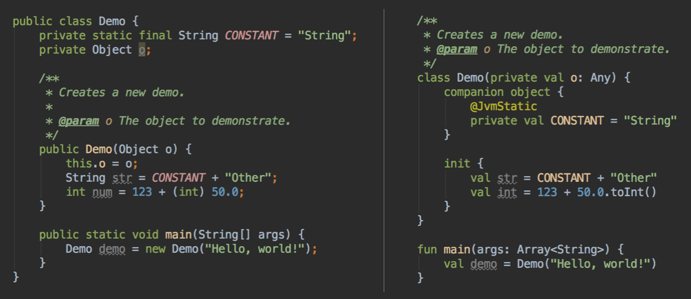

# Yoga Theme

**Yoga** editor color theme for IntelliJ IDEA and Android Studio. Based on amazing [Darcula](https://blog.jetbrains.com/idea/2012/12/intellij-idea-12-is-available-for-download/).

**Yoga** currently supports:

- Java
- Kotlin
- HTML
- Groovy
- Scala
- And much more!

## Installation

- [Download](Yoga.jar) the theme file.
- Select `File` → `Import Settings...`, and point to the downloaded file.
- Ensure that "Editor colors" item is checked, click OK.
- Restart IntelliJ IDEA.
- Go to `Preferences` → `Editor` → `Colors & Fonts` and select `Yoga`.